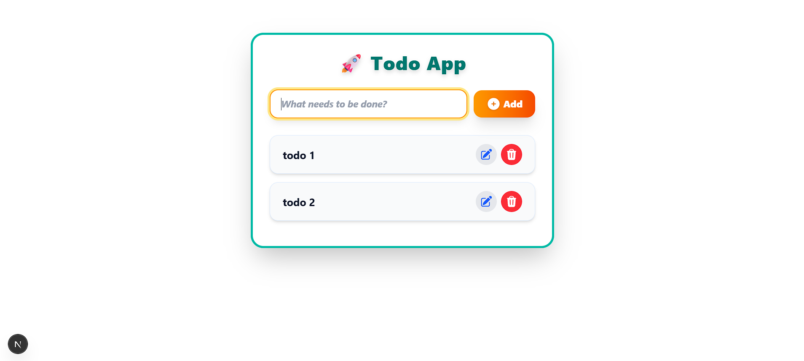

# Todo App

A modern, responsive Todo application built with **Next.js**, **TypeScript**, **Redux Toolkit**, and **Tailwind CSS**.

## Features

- 🚀 **Next.js + TypeScript** for fast, type-safe development
- 📝 **CRUD operations** for todos (Add, Edit, Update, Delete, Complete)
- ⚡ **Redux Toolkit** for state management
- 🎨 **Tailwind CSS** for beautiful, responsive, and dark mode-ready UI
- 🔔 **react-hot-toast** for user notifications
- ✨ Smooth animations and professional design

## Screenshots

 <!-- Add your screenshot if available -->

## Getting Started

### 1. Clone the repository

```sh
git clone https://github.com/YOUR_USERNAME/YOUR_REPO_NAME.git
cd YOUR_REPO_NAME
```

### 2. Install dependencies

```sh
npm install
```

### 3. Run the development server

```sh
npm run dev
```

Open [http://localhost:3000](http://localhost:3000) to see your app.

## Project Structure

```
/app           # Next.js app directory
/components    # Reusable UI components (TodoInput, TodoList, TodoItem)
/redux         # Redux Toolkit slices and store
/types         # TypeScript types
/public        # Static assets
```

## Technologies Used

- [Next.js](https://nextjs.org/)
- [TypeScript](https://www.typescriptlang.org/)
- [Redux Toolkit](https://redux-toolkit.js.org/)
- [Tailwind CSS](https://tailwindcss.com/)
- [react-hot-toast](https://react-hot-toast.com/)
- [Heroicons](https://heroicons.com/)

## Customization

- Easily switch color themes in `Tailwind CSS`
- Update Redux logic in `/redux/todoSlice.ts`
- Add more features as needed!

## License

MIT

---

**Made with ❤️ using Next.js, TypeScript, Redux, and Tailwind